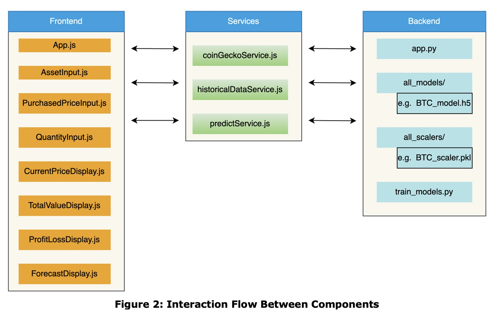

# 📱 CryptoProphet: Mobile App

## A cryptocurrency portfolio management app with predictive market models.

# 📘 Overview

The **App** folder folder contains the source code for the **Mobile App** of **CryptoProphet**, developing using **React Native** and integrated with a Flask backend. This app enbales users to manage their cryptocurrency portfolios, fetch real-time prices, and predict future values using advanced machine learning models.

# 📂 Directory Structure

```plaintext
App/
├── App.js                         # Main entry point for the app
├── app.json                       # Configuration for the app
├── assets/                        # Contains images, fonts, and other static resources
├── babel.config.js                # Babel configuration for the app
├── backend/                       # Flask backend code
│   ├── all_models/                # Trained ML models (LSTM, GRU, Bi-LSTM)
│   ├── all_scaler/                # Scalers used for preprocessing data
│   ├── app.py                     # Flask API to handle predictions
│   ├── requirements.txt           # Backend dependencies
│   ├── train_models.py            # Script for training machine learning models
├── components/                    # Reusable React Native components
│   ├── AssetInput.js              # Handles user input for crypto assets
│   ├── CurrentPriceDisplay.js     # Displays the current price of selected cryptos
│   ├── ForecastDisplay.js         # Displays future price predictions
│   ├── PurchasedPriceInput.js     # Handles user input for purchased price
│   ├── QuantityInput.js           # Handles user input for purchased quantity
│   ├── TotalValueDisplay.js       # Displays the total value of the portfolio
├── package.json                   # NPM dependencies and project metadata
├── package-lock.json              # Locks the dependency versions
├── services/                      # Contains service scripts for API and data handling
│   ├── coinGeckoService.js        # Fetches live data from the CoinGecko API
│   ├── historicalDataService.js   # Retrieves historical crypto data
│   ├── predictService.js          # Sends data to Flask API and fetches predictions
├── README.md                      # Documentation for the App folder
```

# **🔁 Interaction Flow Between Components**

The diagram below illustrates the interaction between the **Frontend**, **Services**, and **Backend** components of the CryptoProphet application. Each component communicates seamlessly to provide real-time predictions and display relevant information to the user.



### **Component Overview**

1. **Frontend**:

   - Handles the user interface and user inputs.
   - Components include:
     - `App.js`: Main application entry point.
     - `AssetInput.js`: Input for selecting a cryptocurrency.
     - `PurchasedPriceInput.js`: Input for entering the purchased price.
     - `QuantityInput.js`: Input for entering the purchased quantity.
     - `CurrentPriceDisplay.js`: Displays real-time prices fetched from the API.
     - `TotalValueDisplay.js`: Calculates and displays total portfolio value.
     - `ProfitLossDisplay.js`: Displays profit or loss information.
     - `ForecastDisplay.js`: Displays forecasted cryptocurrency prices.
2. **Services**:

   - Acts as a bridge between the frontend and backend.
   - Components include:
     - `coinGeckoService.js`: Fetches real-time cryptocurrency prices.
     - `historicalDataService.js`: Retrieves historical data for analysis.
     - `predictService.js`: Fetches model predictions from the backend.
3. **Backend**:

   - Processes the data and returns predictions to the frontend via APIs.
   - Components include:
     - `app.py`: Flask API for managing requests and responses.
     - `all_models/`: Directory containing trained models (e.g., `BTC_model.h5`).
     - `all_scalers/`: Directory containing scaling parameters (e.g., `BTC_scaler.pkl`).
     - `train_models.py`: Script for training machine learning models.

This flow ensures a robust and modular architecture, enabling seamless communication between all components.

# 🚀 Features

* **Portfolio Management**: Track your cryptocurrency assets, including purchased price, quantity, and total value.
* **Real-Time Data**: Fetch live cryptocurrency prices using the CoinGeck API.
* **Future Predictions**: Leverage advancd machine learning models (LSTM, GRU, Bi-LSTM) to predictive future prices.
* **Customizable Inputs**: Input your own purchased prices and quantities for accuraties for accurate portfolio tracking.

# 📊 Components

## Frontend (React Native Components)

* **AssetInput.js**: Input fields for adding cryptocurrency assets.
* **CurrentPriceDisplay.js**: Displays the latest prices for the selected cryptos.
* **ForecastDisplay.js**: Shows predictions for future prices.
* **PurchasedPriceInput.js**: Input fields for specifying purchased prices.
* **QuantityInput.js**: Input fields for specifying purchased quantities.
* **TotalValueDisplay.js**: Displays the total portfolio value, including profit/loss calculations.

## Backend (Flask API)

* app.py: Handles API requests for predictions and integrates with trained models.
* train_models.py: Contains scripts for training LSTM, GRU, and Bi-LSTM models.
* all_models/: Folder with pre-trained models.
* all_scaler/: Contains preprocessing scalers for input data.

# 🔧 Installation

## Prerequisites

* Node.js installed on your system.
* Python for the backend
* A virtual environment for managing Python dependencies

## A. Set Up the Backend

1. Navigate to the backend folder:

   cd backend
2. Create and activate a Python virtual environment:

   a) On macOS/Linux:

   python3 -m venv crypto_venv
   source crypto_venv/bin/activate

   b) On Windows:

   python -m venv crypto_venv
   crypto_venv\Scripts\activate
3. Install the required dependencies:

   pip install -r requirements.txt
4. Start the Flask API:

   python app.py

## B. Set Up the Mobile App

1. Navigate to the **App** directory:

   cd App
2. Install the dependencies:

   npm install
3. Start the development server:

   npm start

## C. Retrain the Models (Optional)

**Note**: The Model is trained and saved in the **all_models/** folder, and the preprocessing scalers saved in the **all_scaler/** folder. However if you want to retrain the machine learning models from scratch (e.g, with updated data), run the following python scripts:

python train_models.py

# 🌐 APIs Used

### CoinGecko API:

* Provides real-time cryptocurrency prices.
* Intgrated via coinGeckoService.js

# 🛠 Technologies Used

* ##### Frontend:


  - React Native
  - Expo
* Backend:

  - Flask
  - TensorFlow/Keras/Sci-learn
* APIs:

  - CoinGecko API for live price data

# 📜 Troubleshooting

Common Issues:

1. Port Conflicts:

   - Ensure no other services are using ports 3000 (Reactive Native) or 5000 (Flask API) or change the ports numbers
2. dependency Issues:

   - Reinstall dependencies:

   npm install
   pip install -r requirements.txt
3. API Connectivity:

   - Verify the CoinGecko API is accessible and the Flask API is running.

# ⚡ Key Scripts

1. Start the App:

   npm start
2. Start the Flask API:

   python app.py
3. Train Models (Optional):

   python train_models.py


---

# 🎥 Demo Video

The following demo showcases the CryptoProphet app in action, including how it handles user inputs, real-time data fetching, and predictive modeling.

<p align="center">
  <video width="640" height="360" controls>
    <source src="https://drive.google.com/uc?id=1AbCdEfGHIjKlmnOPqrStUvWXYz123456" type="video/mp4">
    Your browser does not support the video tag.
  </video>
</p>

[📥 Watch the Demo](https://drive.google.com/file/d/1zsSB-db6ec-ZJmlSocSQ9Neu3KH-j3nk/view?usp=drive_link) [Video](https://drive.google.com/file/d/1zsSB-db6ec-ZJmlSocSQ9Neu3KH-j3nk/view?usp=drive_link)

# 📖 Publication

The project paper, **"CryptoProphet: Building a Cryptocurrency Portfolio App with Integrated Market Predictive Models"**, has been presented and published at the **ISCAP Conference Proceedings**

<a href="https://iscap.us/proceedings/2024/pdf/6133.pdf">
    
    ISCAP Conference Proceedings
</a>

# **👤 Author**

# **Yared Shewarade**

* **Linkedin**: [yared-shewarade](https://www.linkedin.com/in/yared-shewarade-378aa414b/)

- **Email**: [shewaradeyared@gmail.com](mailto:shewaradeyared@gmail.com)
