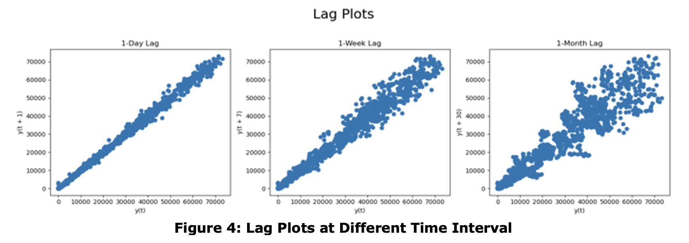
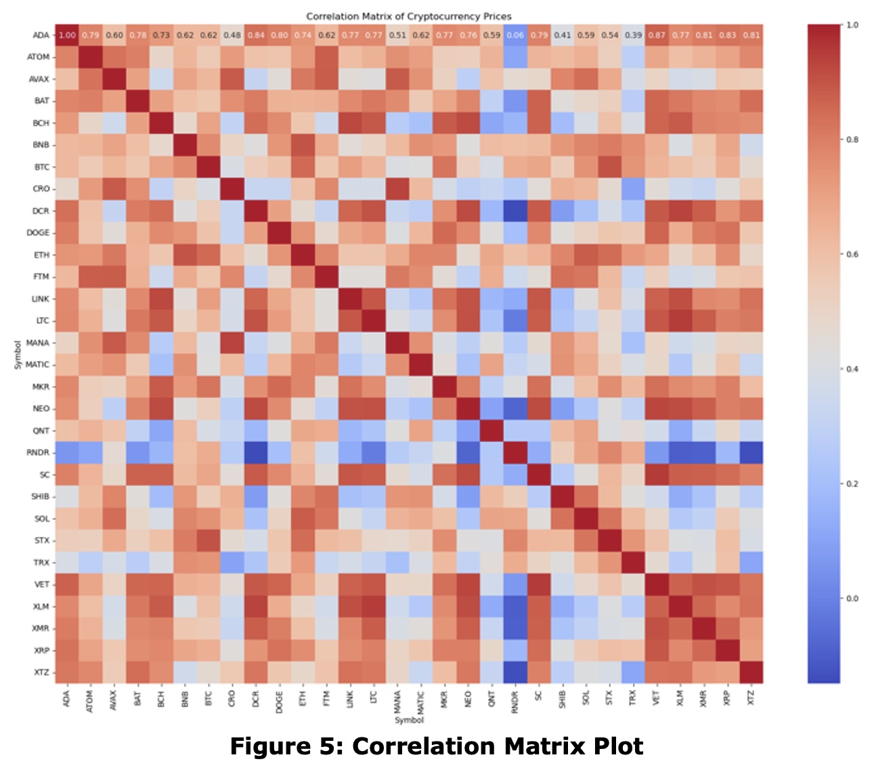
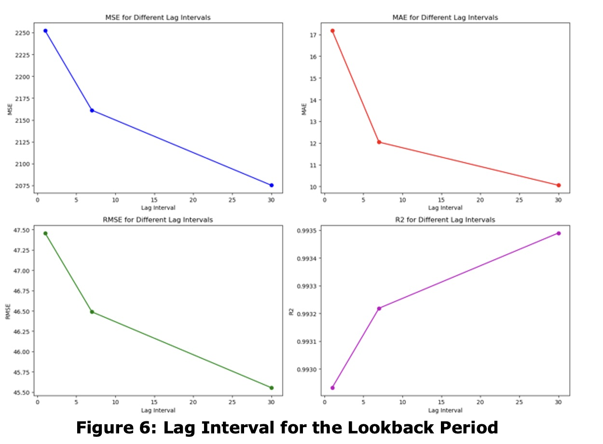
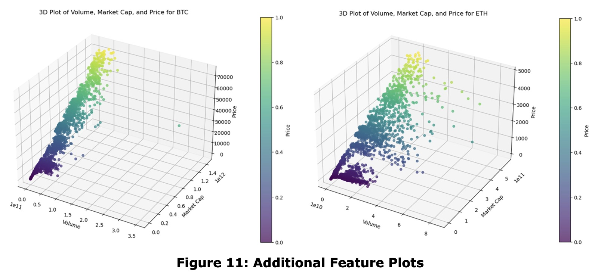
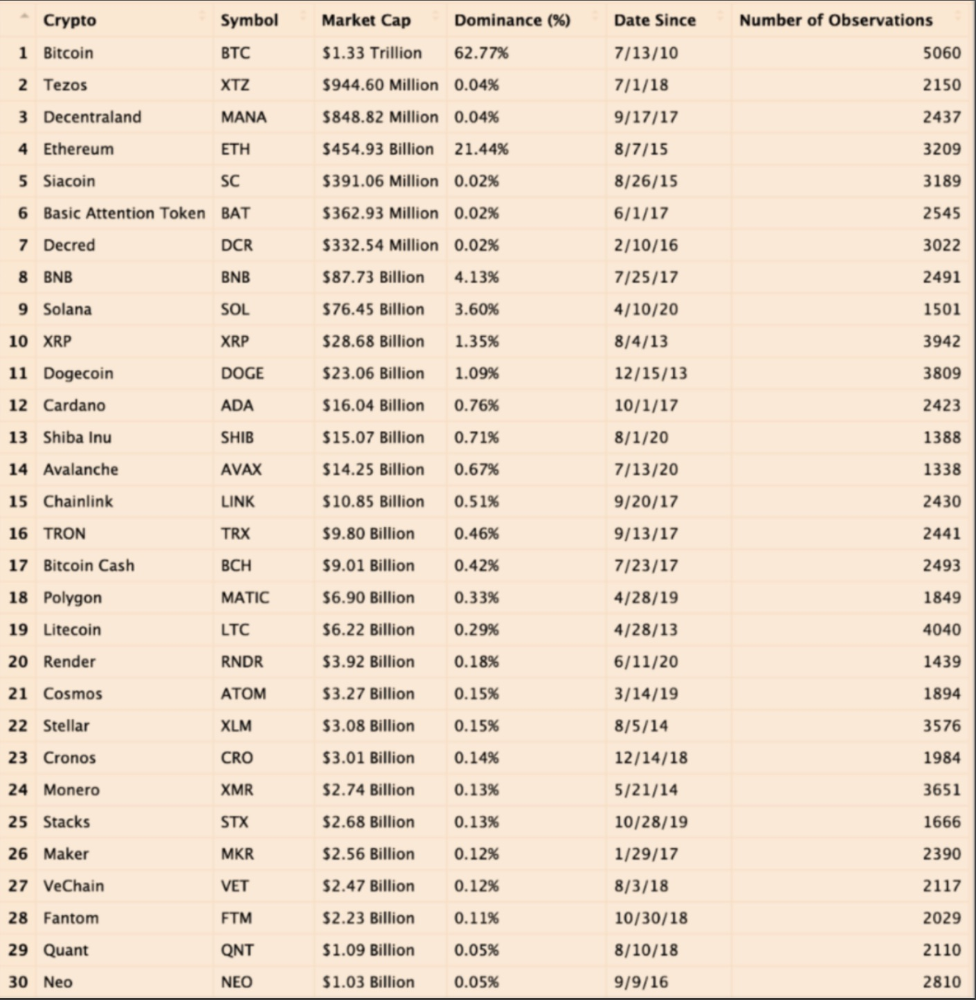
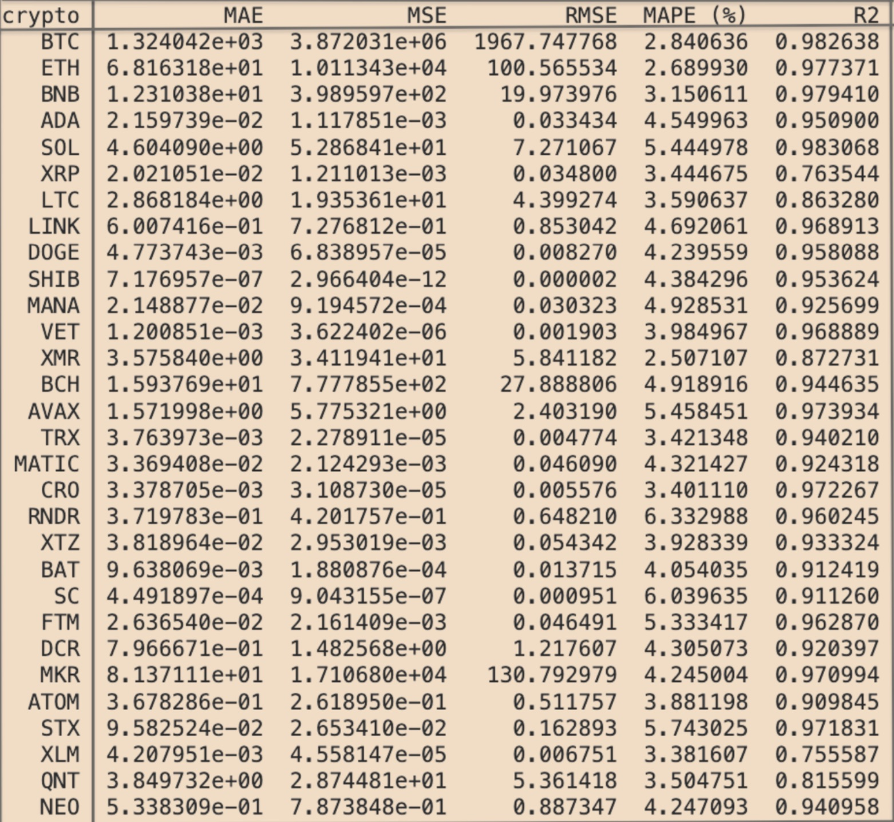

# 📊 Data Analysis

## Detailed analysis of cryptocurrency data for exploratory insights and machine learning model evaluation

# 📘 Overview

The Data Analysis folder contains scripts and visualizations used to analyze and preprocess cryptocurrency data.

This includes:

* Exploratory Data Analysis (EDA) to uncover patterns and trends.
* Data preprocessing for feature engineering and cleaning
* Visualization of key insights to guide predictive modeling

These scripts provide the foundation for training and evaluating machine learning models in the CryptoProphet project.

## Exploratory and predictive analysis of cryptocurrency data.

1. **Lag Plots**

Lag plots were created to identify temporal dependencies in the data. Below is an example of lag plots for daily, weekly, and monthly intervals. These plots demonstrate how price values are correlated across different time lags, which informed feature engineering for model training.



###### Interpretation:

These lag plots show the dependecy of cryptocurrency prices on their past values. The strong linear correlation in the 1-day lag indicates that recent prices are highly predictive of near-term movements, which aligns with short-term focus of models like GRU. The 1-week lag movements, which trends can still inform predictions, while the 1-month lag shows dimishing predictablity. These insights informed our feature engineering process, ensuring our models captured the most relevant dependencies for accurate predictions.

**Note**:- The lag plots provide a snapshot of the relationships between cryptocurrency prices and their past values at different intervals. The 1-day lag shows a strong correlation, indicating that near-term trends are stable. The scatter in the 1-month lag, however, reflects the compecity of long-term price movements. To handle this, the models don't rely on a single lag but instead learn from a sequence of daily data spanning the last month. This enables the models to identiffy cummulative patterns and undelying trends that are not immediately obvious in individual lag correlations.

2. **Correlation Matrix**

The correlation matrix shows the relationships between key features such as prices, volumes, and market capitalization across different cryptocurrencies. Strong correlations between certain variables guided feature selection for the predictive models.



###### Interpretation:

This correlation matrix reveals how the prices of 30 cryptocurrencies are related. Strong correlations, like those between BTC and ETH, indicate shared market trends, while weaker or negative correlations suggest more independent price movements. These insights are critical for both investors and our IMS Strategy, ensuring that the app's predictions are tailored to the unique behavior of each cryptocurrency while leveraging relationships where they exist.

3. **Lookback Period Selection**

The lookback period (number of lag intervals) was analyzed to optimize the model's predictive accuracy. The plots below show how performance metrics (MSE, MAE, RMSE, and R²) vary across lag intervals from 1 to 30 days.



###### Interpretation:

These charts compare the performance of our predictive models using different lag intervals. As shown, a 30-day lag consistently leads to better performance across all metrics (MSE, MAE, RMSE, and R²). This highlights the importance of leveraging longer historical data for prediction while avoiding over-complication. By integrating this into the IMS Stategy, we ensure that each model is optimized for its specific cryptocurrency.

### **Key Observations**

1. **Improvement Over Shorter Lags**:

   - Metrics like **MSE** and **RMSE** decrease with increasing lag intervals, indicating better model performance with longer lookbacks.
   - R² improves significantly as the lag interval increases up to 30 days.
2. **Optimal Lookback Period**:

   - A 30-day lookback period was selected as the optimal interval based on:
     - The lowest **MSE** and **RMSE** values.
     - The highest **R²** values, reflecting a better fit to the data.
3. **Trade-Off**:

   - While longer lookbacks improve accuracy, they also increase computational complexity. A balance was struck to maintain efficiency.

The 30-day lookback period was implemented for all models and cryptocurrencies.

4. 3D Scatter Plots**

3D scatter plots visualize the relationships between volume, market cap, and price for cryptocurrencies like BTC and ETH. These visualizations provide insights into how different factors interact.



###### Interpretation:

This 3D scatter plot illustrates the relationships between Volume, Market Cap, and Price for Bitcoin and Ethereum. For Bitcoin, we see a strong and predictable correlation, indicating a structured market relationship. for Ethereum, the data is more scattered, refecting its dynamic and diverse market factors. These insights validate the importance of including Volume and Market Cap as features in our predictive models, and they also highlight IMS Strategy us essential for tailoring predictions to the unique characteristics of each cryptocurrency.

5. **Cryptocurrency Selection**

The 30 selected cryptocurrencies were chosen based on criteria such as market capitalization, data availability, and trading volume. Below is a table summarizing the selected cryptos.



###### Interpretation:

This table highlights the 30 cryptocurrencies included in the CryptoProphet project. They were selected to represent a diverse cross-section of the market, ranging from dominant assets like Bitcoin and Ethereum to emerging coins liike Render and Quant. The dta availability plays a key role i training time-series models. These differences underline the importnace of the IMS Strategy, ensuring that each asset is paired with the best-performing predictive model tailored to its unique characteristics.

High market cap and dominance crypto are less volatile compared to smaller crypto (BTC, ETH), while smaller market cap and dominance more volatility and higher risk (XTZ, BAT).

The number of observation can directly impact the accuracy of the training model. Newer crypto with fewer observation might need more sophosticated algorithms to achieve comparable predictive performance.

Some of the categories for the selection of 30 cryptos are:

* High market Capitalization
* Medium Market Capitalization
* Low Market Capitalization
* History of Launch
* Market Dominance
* Memes Coins
* Metaverse
* Gaming
* AI Crypto
* Smart Contracts
* Privacy Coins

6. **Model Performance Metrics**

The performance of different machine learning models (LSTM, GRU, Bi-LSTM) was evaluated across the selected 30 cryptocurrencies. The table below highlights key metrics like **Mean Absolute Error (MAE)**, **Mean Squared Error (MSE)**, **Root Mean Squared Error (RMSE)**, **Mean Absolute Percentage Error (MAPE %)**, and **R² Score**.



###### Interpretation:

This table provides the foundation for the Individualized Model Slection (IMS) Strategy. By evaluating each cryptocurrency using key metrics like MAE, MSE, RMSE, MAPE, and R², the most suitable model was identifiied for each asset. For instance, GRU was chosen for BTC due to its high R² and low RMSE, while Bi-LSTM was better for LTC, and LSTM excelled for BAT. This tailored approach ensures that CryptoProphet delivers accurate and reliable predictions for a wide range of cryptocurrecncies, enhancing both user confidence and app utility.

7. **Actual vs Predicted Price**

Below is an example of actual vs. predicted price plots for selected cryptocurrencies, showcasing how closely the models predicted future values.

.jpeg)

.jpeg)

.jpeg)

.jpeg)

.jpeg)

### **Key Observations**

1. **Top Performing Models**:

   - **GRU** consistently performed better for many cryptocurrencies, achieving high **R² values** and low errors.
   - Cryptos like **BTC** and **ETH** showed high predictive accuracy with GRU.
2. **Model Suitability**:

   - Cryptos with high volatility (e.g., **SHIB**, **DOGE**) had slightly higher errors due to unpredictable trends.
3. **MAPE Insights**:

   - Most cryptos have MAPE below 5%, indicating excellent predictive performance.

For detailed metrics and insights, refer to the **[Python notebook](Python/Data_Analysis_and_Reporting.ipynb)**.

## **📜 Links to Detailed Notebooks**

Explore the detailed analysis and notebooks:

- **[Data_Analysis_and_Reporting.ipynb](Python/Data_Analysis_and_Reporting.ipynb)**: Comprehensive Python-based EDA.
- **[Data_Collection_Clean.ipynb](Python/Data_Collection_Clean.ipynb)**: Data cleaning and preprocessing scripts.

---

### **Key Notes**

- **Image Storage**:
  - Place all images in a folder like `Data Analysis/images/` and reference them with relative paths.
- **Keep Explanations Concise**:
  - Provide short, insightful comments for each plot and link to the full notebooks for deeper analysis.

---

Let me know if you'd like further assistance or feedback on organizing the content! 😊

## 📂 Directory Structure

```plaintext
Data Analysis/
├── Python/
│   ├── Data_Analysis_and_Reporting.ipynb   # Comprehensive EDA and reporting in Python
│   ├── Data_Collection_Clean.ipynb         # Data cleaning and preprocessing script
├── R/
│   ├── Heatmap.png                         # Correlation matrix visualization
│   ├── Histogram.png                       # Distribution of key variables
│   ├── TimeSeriesPlot.png                  # Cryptocurrency trends over time
├── README.md                               # Documentation for the Data Analysis folder
```

# 🔍 Key Scripts

### Python Scripts

- Data_Analysis_and_Reporting.ipynb
  - Performs compehensive EDA, including
    - Descriptive statistics
    - Visualization of distributions, trends, and correlations
  - Generates reports to guide model trianing
- Data_Collection_clean.ipynb
  - Cleans raww data for training and analysis
  - Includes feature engineering (e.g., legged values, moving averages)

## 📊 Insights Provided

The scripts and visualizations in this folder aim to:

* Uncover patterns and trends in cryptocurrency data
* Identify correlations and distributions for future selection
* Generate actionable insights to guide model training and evaluation
